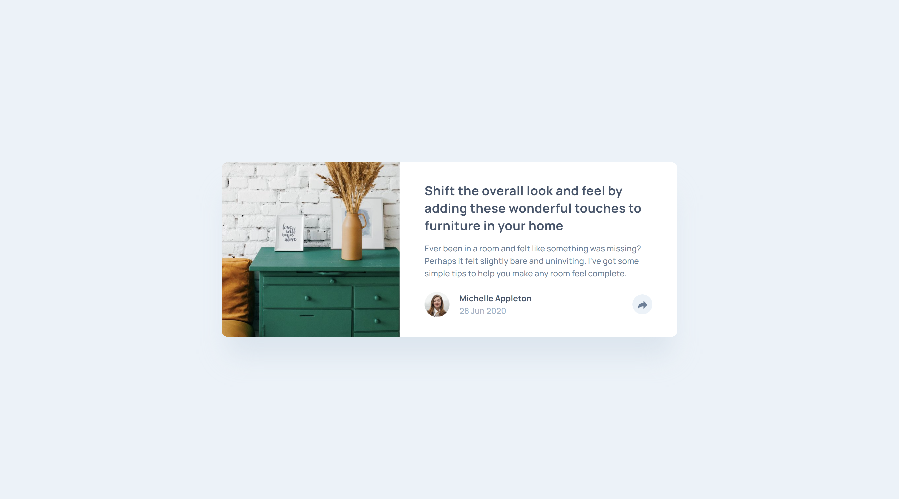
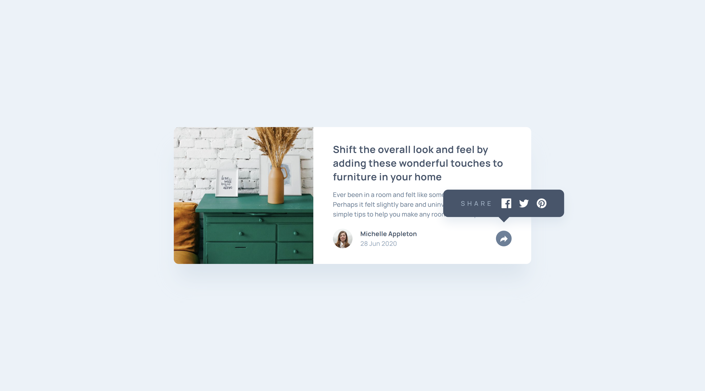
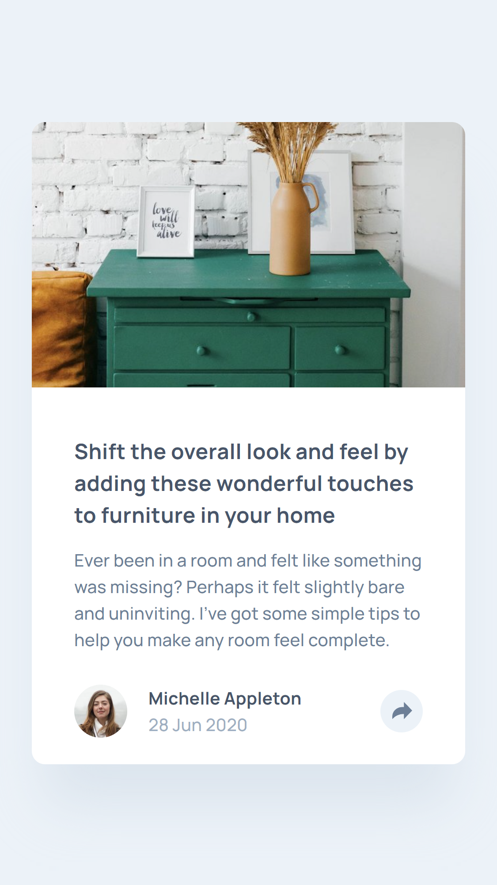
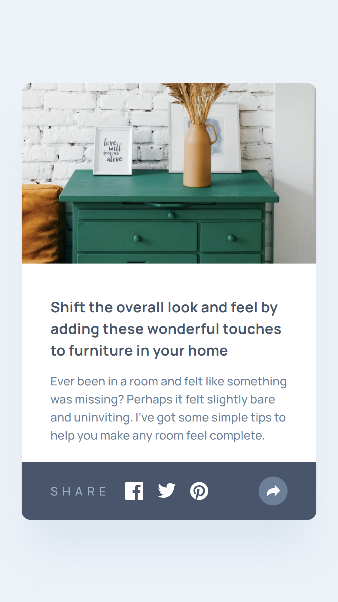

# Frontend Mentor - Article preview component solution

This is a solution to the [Article preview component challenge on Frontend Mentor](https://www.frontendmentor.io/challenges/article-preview-component-dYBN_pYFT). Frontend Mentor challenges help you improve your coding skills by building realistic projects. 

## Table of contents

- [Overview](#overview)
  - [The challenge](#the-challenge)
  - [Screenshot](#screenshots)
  - [Links](#links)
- [My process](#my-process)
  - [Built with](#built-with)
  - [What I learned](#what-i-learned)
  - [Useful resources](#useful-resources)

## Overview

### The challenge

Users should be able to:

- View the optimal layout for the component depending on their device's screen size
- See the social media share links when they click the share icon

### Screenshots

Desktop:

Desktop active:

Mobile:

Mobile active:

### Links

- Live site: <https://michahuhn.github.io/frontendmentor-article-preview-component>
- Challenge solution: <https://www.frontendmentor.io/solutions/article-preview-component-using-vue-and-headless-ui-w2b1ls86bv>

## My process

### Built with

- Vue
- [Headless UI](https://headlessui.com/v1/vue)
- SCSS
- CSS custom properties
- CSS Grid
- Flexbox
- Semantic HTML5 markup
- Mobile-first workflow
- Accessibility

### What I learned

I learned how to implement a popover component of the Headless UI library.

### Useful resources

- [Popover - Headless UI](https://headlessui.com/v1/vue/popover) - How to create the popover component.
- [Get your stylesheets more organized with Sass partials - YouTube](https://www.youtube.com/watch?v=9Ld-aOKsEDk) - My SCSS folder structure is inspired by this video.
